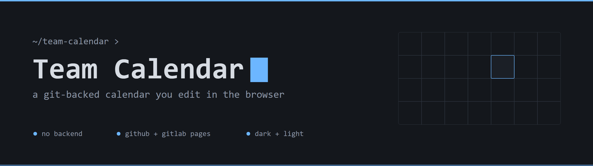
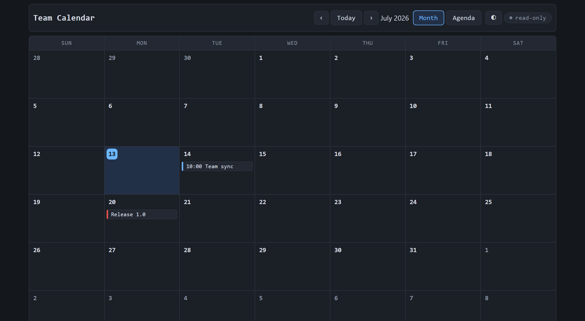
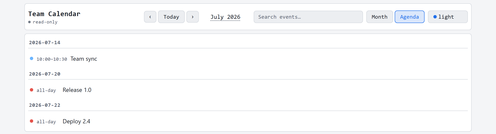

A static, git-backed team calendar you edit right in the browser.


## Overview

Team Calendar is a static, git-backed team calendar. Events live in a plain
`events.json` file in this repo. You edit them in the browser, and the change
is committed straight back to the repo as a real git commit — no backend, no
build step, no database.

## Screenshots

| Month view | Agenda view |
| --- | --- |
|  |  |

## Features

- In-browser editing — create, edit, and delete events without leaving the page
- Per-user Personal Access Token (PAT) access model — no shared credentials
- Three themes — dark, light, and **workbench** (matches the [Terminal Workbench design system](https://github.com/Real-Fruit-Snacks/terminal-workbench-design-system)); cycle with the theme button
- Month and agenda views
- Category colors for at-a-glance scanning
- Runs on **GitHub Pages** and **GitLab Pages**
- Offline / air-gapped hostable — no external services required
- Full edit history via git — every change is a real commit

## How it works

**Reading** the calendar is just a static file fetch: the page loads
`events.json` as a plain same-origin file. This works identically on GitHub
Pages, GitLab Pages, an air-gapped GitLab instance, or `localhost` — there
are no API rate limits, and read-only viewers don't need a token at all.

**Editing** requires a Personal Access Token. The first time you try to
create or change an event, you're prompted to paste your own GitHub or
GitLab PAT. It's stored only in your browser's `localStorage` — it's never
sent anywhere except the host's own API when you save. Saving commits the
updated `events.json` back to the repo via the host's file API (the GitHub
Contents API or the GitLab Repository Files API).

The access model is simple: **if you can access the repo, you can edit the
calendar.** A write-scoped token is your permission — there's no separate
allowlist to manage. Revoking someone's repo access revokes their ability to
edit. Every edit is a real git commit attributed to the person who made it,
so the full history is just `git log`.

Near-simultaneous edits are conflict-safe: saves use optimistic concurrency
(the current commit ref is sent with the write) and automatically retry once
— re-fetching the latest version and re-applying your change — if someone
else saved in between.

## Quick start (GitHub Pages)

1. Push this repo to GitHub.
2. In **Settings → Pages**, set the source to **GitHub Actions** (the included
   workflow at `.github/workflows/pages.yml` builds and deploys automatically).
3. Open the deployed site.
4. Click a day to create an event. When prompted for a token, use the guided
   popup's **"Create one now →"** link, which opens GitHub's token creation
   page pre-filled with the right scope. Paste the token back in, and edit
   away.

## Self-host on GitLab / offline

Set `config.json` at the repo root:

```json
{
  "host": "gitlab",
  "origin": "https://your-gitlab.example.com",
  "projectId": 123,
  "branch": "main"
}
```

The included `.gitlab-ci.yml` publishes the static files to GitLab Pages —
no internet access or npm install required, so it works on air-gapped GitLab
instances too.

## Data format

Events and categories live in `events.json`:

```json
{
  "version": 1,
  "categories": [
    { "id": "meeting", "label": "Meeting", "color": "#6cb6ff" }
  ],
  "events": [
    {
      "id": "evt_seed01",
      "title": "Team sync",
      "date": "2026-07-14",
      "allDay": false,
      "start": "10:00",
      "end": "10:30",
      "category": "meeting",
      "description": "Weekly standup"
    }
  ]
}
```

## Architecture

The app is plain ES modules with no build step, split into small,
independently-testable pieces:

| Module | Responsibility |
| --- | --- |
| `assets/js/dates.js` | Pure date/calendar-grid math |
| `assets/js/model.js` | Event/category data model helpers |
| `assets/js/host.js` | GitHub/GitLab file API adapters (get/put, base64, token URLs) |
| `assets/js/store.js` | Load/save orchestration with conflict-retry |
| `assets/js/token.js` | PAT storage in `localStorage` |
| `assets/js/render.js` | Month grid and agenda rendering |
| `assets/js/ui.js` | Modals, token popup, theme toggle |
| `assets/js/app.js` | Wiring/bootstrap |

The pure-logic modules (`dates`, `model`, `host`, `store`, `token`) are unit
tested with Node's built-in test runner — zero dependencies:

```bash
npm test
```

There is no bundler, transpiler, or framework: `index.html` loads
`assets/js/app.js` as a native ES module.

## License

MIT — see [LICENSE](LICENSE).
